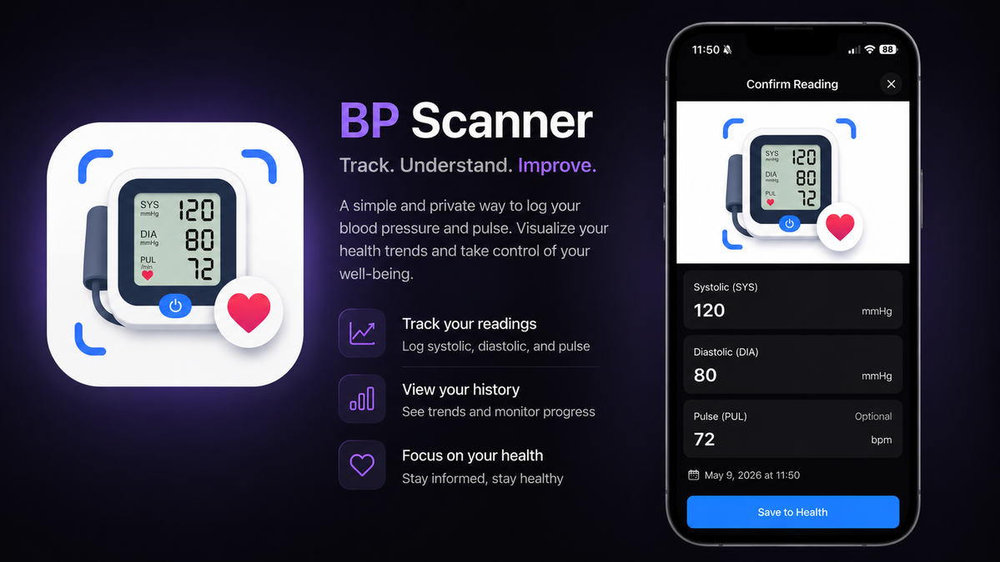
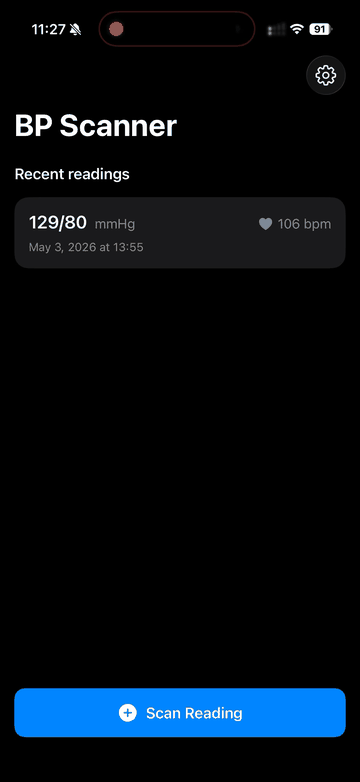

# BPScanner



BPScanner is an iOS app for capturing blood pressure monitor photos, extracting systolic, diastolic, and pulse readings, and saving reviewed readings to Apple Health.

The app is experimental and is not a medical device. Always review readings before saving them, and follow guidance from a qualified clinician for medical decisions.



## Features

- Camera and photo-library import for monitor images
- Roboflow-based scanner using a custom model trained for blood pressure monitor displays
- Gemini Vision scanner fallback support
- Manual entry and review before saving
- Apple Health integration for blood pressure and pulse history
- English and Latin American Spanish localization strings

## Requirements

- Xcode 26 or newer
- iOS 26 SDK or newer
- An Apple developer account with HealthKit capability enabled for device testing
- Optional: Roboflow and Gemini API keys for the cloud scanning paths

## Setup

1. Open `BPScanner.xcodeproj` in Xcode.
2. Copy `Config/GeminiSecrets.example.xcconfig` to `Config/GeminiSecrets.xcconfig`.
3. Add any API keys you want to use:

   ```xcconfig
   ROBOFLOW_API_KEY = your_roboflow_key
   GEMINI_API_KEY = your_gemini_key
   ```

4. Select the `BPScanner` scheme.
5. Build and run on a physical device for camera and HealthKit testing.

`Config/APIKeys.xcconfig` is tracked with blank defaults. `Config/GeminiSecrets.xcconfig` is ignored and should never be committed.

## Scanning

Roboflow is currently the primary scanner. Gemini support remains available in the codebase, and the Apple Vision OCR plus Foundation Models path is documented as an attempted local approach that was discarded for primary use because OCR struggled with seven-segment display digits.

See [docs/SCANNING.md](docs/SCANNING.md) for the scanner architecture and tradeoffs.

## Testing

Run the unit tests from Xcode with the `BPScanner` scheme. The existing tests cover view-model validation and Roboflow response parsing behavior.

## Contributing

See [CONTRIBUTING.md](CONTRIBUTING.md).

## License

Apache License 2.0. See [LICENSE](LICENSE).
